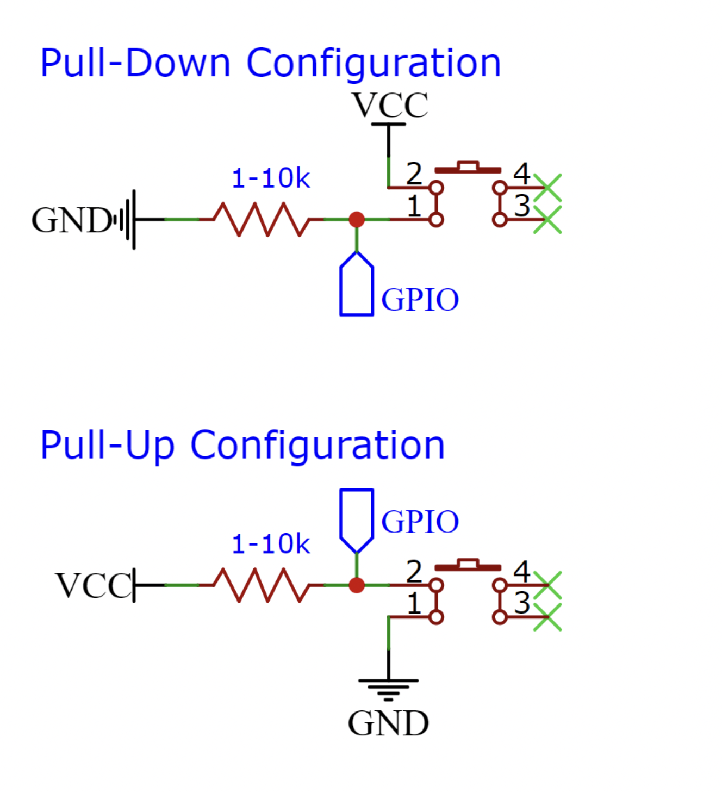

<div align='center'>
  <a href="https://www.utep.edu/engineering/ece/">
    
    <h1>
      Electrical and Computer Engineering Department
    </h1>
  </a>
</div>

# **Lab 2 Interrupts: Fire Alarm! :rotating_light:**

## **Objective**
* Understand how to use the [Espressif GPIO interrupts](https://docs.espressif.com/projects/esp-idf/en/latest/esp32/api-reference/peripherals/gpio.html#api-reference-normal-gpio). This lab will consist of simulating your own **fire alarm**! There is an additional driver that was developed to facilitate the use of LEDs. Student must use 2 external interrupts either pull-up or pull-down configuration.

## **Bonus**
- **Undergrad Bonus:**
    * Display fire alarm `status` in terminal whenever it is **active**
- **Grad Bonus:**
    * Add another `LED` to indicate when *fire alarm* is **disable**
                
## **ESP32 Pinout**
~~~
                                         +-----------------------+
                                         | O      | USB |      O |
                                         |        -------        |
                                     3V3 | [ ]               [ ] | VIN
                                     GND | [ ]               [ ] | GND
     Touch3 / HSPI_CS0 / ADC2_3 / GPIO15 | [ ]               [ ] | GPIO13 / ADC2_4 / HSPI_ID / Touch4
 CS / Touch2 / HSPI_WP / ADC2_2 /  GPIO2 | [ ]               [ ] | GPIO12 / ADC2_5 / HSPI_Q / Touch5
      Touch0 / HSPI_HD / ADC2_0 /  GPIO4 | [ ]               [ ] | GPIO14 / ADC2_6 / HSPI_CLK / Touch6
                         U2_RXD / GPIO16 | [ ]               [ ] | GPIO27 / ADC2_7 / Touch7
                         U2_TXD / GPIO17 | [ ]               [ ] | GPIO26 / ADC2_9 / DAC2
                      V_SPI_CS0 /  GPIO5 | [ ]  ___________  [ ] | GPIO25 / ADC2_8 / DAC1
                SCK / V_SPI_CLK / GPIO18 | [ ] |           | [ ] | GPIO33 / ADC1_5 / Touch8 / XTAL32
        U0_CTS / MSIO / V_SPI_Q / GPIO19 | [ ] |           | [ ] | GPIO32 / ADC1_4 / Touch9 / XTAL32
                 SDA / V_SPI_HD / GPIO21 | [ ] |           | [ ] | GPIO35 / ADC1_7 
                  CLK2 / U0_RXD /  GPIO3 | [ ] |           | [ ] | GPIO34 / ADC1_6 
                  CLK3 / U0_TXD /  GPIO1 | [ ] |           | [ ] | GPIO39 / ADC1_3 / SensVN 
        SCL / U0_RTS / V_SPI_WP / GPIO22 | [ ] |           | [ ] | GPIO36 / ADC1_0 / SensVP 
                MOSI / V_SPI_WP / GPIO23 | [ ] |___________| [ ] | EN 
                                         |                       |
                                         |  |  |  ____  ____  |  |
                                         |  |  |  |  |  |  |  |  |
                                         |  |__|__|  |__|  |__|  |
                                         | O                   O |
                                         +-----------------------+
~~~

## **Example**
Here is an example of a how to use ESP32 GPIO advance setup. The following code will toggle the onboard LED if button is pressed and have a external LED toggling every half second.

~~~c
#include <stdio.h>
#include "freertos/FreeRTOS.h" 
#include "freertos/task.h" 
#include "driver/gpio.h"

#define ESP_INTR_FLAG_DEFAULT 0 /* Interrupt flag configuration */

#define LOW     0   /* low logic  */
#define HIGH    1   /* high logic */

#define ONBOARD_LED     2    /* onboard led pin  */
#define EXTERNAL_LED    22   /* external led pin  */
#define BUTTON          23   /* button pin  */

/**
 * @brief Toggle gpio pin
 * 
 * @param pin gpio pin
 * @return None
 */
void toggle(gpio_num_t pin){
    /* Get current level and toggle LED */
    gpio_get_level(pin) ? gpio_set_level(pin, LOW) : gpio_set_level(pin, HIGH);
}

/* GPIO interrupt handler */
static void IRAM_ATTR gpio_isr_handler(void* arg) {
    /* store argument */
    gpio_num_t gpio = (gpio_num_t) arg;

    /* toggle LED */
    toggle(gpio);

}

/* GPIO setup */
void gpio_setup(void) {
    /* IO configuration */
    gpio_config_t io_conf;
    
    /* Input configuration */
    io_conf.intr_type = GPIO_INTR_POSEDGE;  /* Set up as Positive Edge */ 
    io_conf.mode = GPIO_MODE_INPUT;     /* Set pins as input */
    io_conf.pin_bit_mask = (1ULL << BUTTON);  /* Add input bit mask */
    io_conf.pull_down_en = 1;   /* Enable pulldown */
    io_conf.pull_up_en = 0;     /* Disable pullup */

    /* Set configuration */
    gpio_config(&io_conf);

    /* Output configuration */
    io_conf.intr_type = GPIO_INTR_DISABLE;  /* Disable interrupt */
    io_conf.mode = GPIO_MODE_OUTPUT;        /* Set as output*/
    io_conf.pin_bit_mask = (1ULL << ONBOARD_LED) | (1ULL << EXTERNAL_LED); /* Add output bit mask */
    io_conf.pull_down_en = 0;   /* Disable pulldown */
    io_conf.pull_up_en = 0;     /* Disable pullup */

    /* Set configuration */
    gpio_config(&io_conf);

    /* Set default interrupt flag */
    gpio_install_isr_service(ESP_INTR_FLAG_DEFAULT);

    /* Add ISR handler */
    gpio_isr_handler_add(BUTTON, gpio_isr_handler, (void*) BUTTON); 

}
void app_main() {

    /* Setup the GPIOs */
    gpio_setup();

    while(1){
         toggle(EXTERNAL_LED); /* Toggle external led */
         vTaskDelay(500/portTICK_PERIOD_MS); /* .5 second delay */
    }

}
~~~

## **Lab Template**
~~~c
#include <stdio.h>
#include "freertos/FreeRTOS.h"
#include "freertos/task.h"
#include "driver/gpio.h"
#include "driver/led.h"

#define ESP_INTR_FLAG_DEFAULT   0   /* Interrupt flag configuration */

#define ONBOARD_LED             2   /* Onboard led */

/* Update with custom pins */
#define SMOKE_DETECTOR_PIN      0  /* Smoke detector pin */
#define DISABLE_ALARM_PIN       0  /* Disable alarm pin */

/**
 * \struct fire_alarm_t
 * \brief Fire alarm object
 * @see led.h 
 */
typedef struct{
    led_t indicator;            /*!< led indicator */
    gpio_num_t  smokeDetector;  /*!< smoke detector pin */
    gpio_num_t  disableAlarm;   /*!< disable alarm pin */
    bool active;                /*!< fire alarm state */
}fire_alarm_t;

/* Global fire alarm object */
fire_alarm_t utep_alarm;

/* GPIO interrupt handler */
static void IRAM_ATTR gpio_interrupt_handler(void * arg) {
    /* Typecast argument */
    gpio_num_t gpio = (gpio_num_t) arg;

    /* Check if smoke detector pin has been pressed or disable alarm */
    
}

/**
 * @brief Set up fire alarm interrupt
 * 
 * @param alarm pointer to fire alarm object
 * @return None
 */
void fire_alarm_interrupt_setup(fire_alarm_t * const alarm){

    /* IO configuration */
    gpio_config_t io_conf;

    /* Interrupt configuration */
    io_conf.intr_type =  ;
    io_conf.mode = ;
    io_conf.pin_bit_mask = ;
    io_conf.pull_down_en = ;
    io_conf.pull_up_en = ;
    
    /* Set configuration */
    gpio_config(&io_conf);

    /* Set default interrupt flag */
    gpio_install_isr_service(ESP_INTR_FLAG_DEFAULT);    
   
    /* Add ISR handler */
    gpio_isr_handler_add(alarm->startFireAlarm, gpio_interrupt_handler, (void *) alarm->smokeDetector);
    /* Add missing interrupt */

}

void app_main(void)
{
    /* Initialize fire alarm object */

    /* Enable led*/
    
    while(1){
        /* Check if alarm has been activate */
        if(utep_alarm.active){
            /* Toggle indicator led @ 500 ms */
           
        }else{
            /* 100 ms delay */
            vTaskDelay(100 / portTICK_PERIOD_MS);
        }
    }

}
~~~

## **C helpful functions**

For this lab, there are a couple of additional functions from `Espressif` that are important for using inputs. In the previous lab, we had used `gpio_set_direction(gpio_num_t gpio_num, gpio_mode_t mode)` set our inputs and outputs. However, will now use a different approach by using `gpio_config_t`. This new apporach allows to create input and output in a more condense fashion with structures. The structure has various members with their own data types. Please look into them inorder select the correct value when developing the lab.
~~~c 
typedef struct {
    uint64_t pin_bit_mask;          /*!< GPIO pin: set with bit mask, each bit maps to a GPIO */
    gpio_mode_t mode;               /*!< GPIO mode: set input/output mode                     */
    gpio_pullup_t pull_up_en;       /*!< GPIO pull-up                                         */
    gpio_pulldown_t pull_down_en;   /*!< GPIO pull-down                                       */
    gpio_int_type_t intr_type;      /*!< GPIO interrupt type                                  */
} gpio_config_t;
~~~

There are significant difference in how to set the interrupts. Here is a brief description of pull-up and pull-down to help you for the lab.

| Interrupt Configuration | Description     | Logic             |
| :---                    | :---            | :---              |
| **Pull-up**             | Falling edge    | **1** -> **0**    |
| **Pull-down**           | Rising edge     | **0** -> **1**    |

For this lab will we keep the interrupt flag to its default settings which would be `0`. In order to set the interrupt flag, the following function is required: `gpio_install_isr_service(int intr_alloc_flags)`.
~~~c
esp_err_t gpio_install_isr_service(int intr_alloc_flags)
~~~

Lastly, `static void IRAM_ATTR gpio_isr_handler(void* arg)` is the interrupt service routine and can be alter if necessary as long as it has `IRAM_ATTR` which indicated its an interrupt. Also, in order to add any input to enter the interrupt routine, you must `add` it to isr handler:  `gpio_isr_handler_add(gpio_num_t gpio_num, gpio_isr_t isr_handler, void *args)`.
~~~c
esp_err_t gpio_isr_handler_add(gpio_num_t gpio_num, gpio_isr_t isr_handler, void *args)
~~~

## **Pull-up and Pull-down Configuration**



## **Warning** :warning:
The bit mask in `gpio_config_t` is an `uint64_t` value and ESP32 uses `enum` for its pinout. Therefore, in order to mask the bits correctly you must bit shift desire pin by an unsigned long long (`ULL`). 
```c
#define ONBOARD_LED     2 /* ESP32 onboard led */
uint64_t bitmask = (1ULL << ONBOARD_LED); /* Convert onboard led value to unsigned long long */
```

## **Add led driver to ESP32 Project**
1) Copy driver folder
2) Paste into esp project
3) Edit project CMakeLists.txt to use led.c:
```cmake
idf_component_register(SRCS "main.c"
                            "driver/led.c"
                    INCLUDE_DIRS ".")
```

## **Additional Links**
* [Espressif GPIO Driver API](https://docs.espressif.com/projects/esp-idf/en/latest/esp32/api-reference/peripherals/gpio.html#)

### **Authors**
* [**Jesus Minjares**](https://github.com/jminjares4)
  * **Master of Science in Computer Engineering** <br>
    [](https://www.linkedin.com/in/jesusminjares/) [](https://github.com/jminjares4)
* [**Erick Baca**](https://github.com/eabaca2419)
  * **Master of Science in Computer Engineering** <br>
    [](https://www.linkedin.com/in/erick-baca/) [](https://github.com/eabaca2419)
